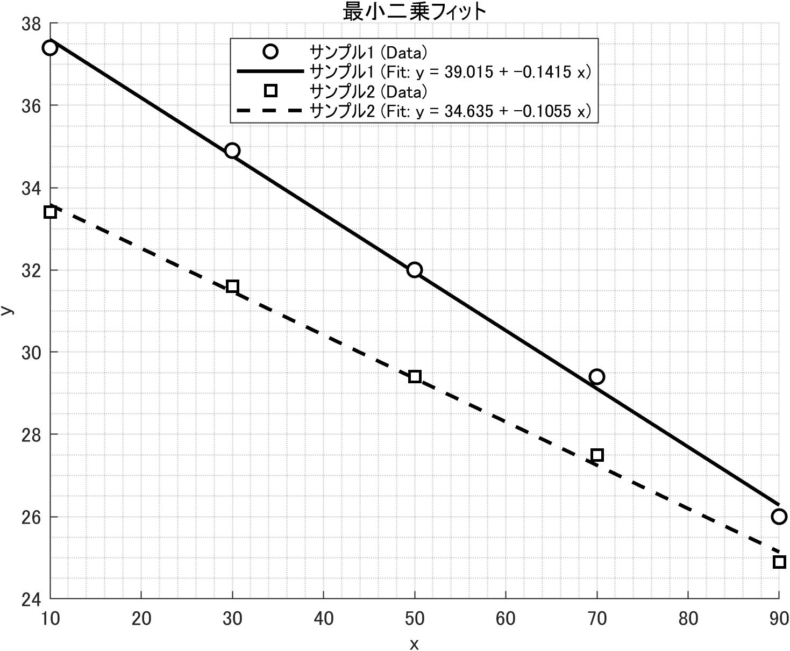

# GraphPlotter

複数のデータセットに対して **最小二乗法** による回帰直線・多項式フィットを行い、  
同一グラフ上にモノクロ描画する MATLAB スクリプト 



- データ点：黒枠＋白塗り（○, □, △…）
- フィット線：黒色、データごとに **線種（実線・破線・一点鎖線・点線）** で区別
- タイトル、軸ラベル、凡例名を実行時に指定可能
- 出力：
  - グラフ PNG（高解像度）
  - 計算結果 TXT（回帰式, R², RMSE, データ数）

保存先はスクリプトと同じフォルダ直下の `results/` フォルダ（自動作成）

---

## 使い方

### データ入力方法

1. **手入力**

   * データセット数を入力 → 各データの `x`, `y` を `[1 2 3 4]` の形式で入力
   * 凡例名は任意指定（未入力なら自動命名）
2. **CSVファイル選択**

   * 複数ファイルを選択可能（GUIダイアログ）
   * CSVは **1列目=x, 2列目=y**（ヘッダ無し推奨）
   * 凡例名はファイル名が自動的に使われる
3. **ヘルプ**

   * マニュアルを表示して終了

---

## 出力例

* **PNGファイル**

  * タイトル・凡例・軸ラベルを含んだグラフ
* **TXTファイル**

  * 各データセットごとに

    * 回帰式
    * 決定係数 $R^2$
    * RMSE（二乗平均平方根誤差）
    * データ数 $N$

---

## 本プログラムで使用した理論

### 問題設定

与えられたデータ点 $(x_i, y_i)$ を直線

$$
y = a + b x
$$

で近似する。

### 誤差の定義

各点の残差を

$$
e_i = y_i - (a + b x_i)
$$

とし、残差平方和

$$
S(a,b) = \sum_{i=1}^{N} e_i^2
$$

を最小化する。

### 正規方程式

偏微分して整理すると、以下の連立方程式を得る：

$$
\begin{cases}
N a + b \sum x_i = \sum y_i \\
a \sum x_i + b \sum x_i^2 = \sum x_i y_i
\end{cases}
$$

行列形式で表すと：

$$
X = \begin{bmatrix}
1 & x_1 \\
1 & x_2 \\
\vdots & \vdots \\
1 & x_N
\end{bmatrix},
\quad
\beta = \begin{bmatrix} a \\ b \end{bmatrix},
\quad
y = \begin{bmatrix} y_1 \\ y_2 \\ \vdots \\ y_N \end{bmatrix}
$$

$$
X^\mathsf{T} X \beta = X^\mathsf{T} y
$$

### 解

$$
\hat{\beta} = (X^\mathsf{T} X)^{-1} X^\mathsf{T} y
$$

MATLABでは

```matlab
coef = X \ y;
```

と書くだけで、この最小二乗解を計算できる。

### 精度指標

* **決定係数 $R^2$**

  $$
  R^2 = 1 - \frac{\text{SSE}}{\text{SST}}
  $$

  * SSE = 残差平方和
  * SST = 全体平方和
    $R^2=1$ に近いほどモデルの説明力が高い。

* **RMSE（二乗平均平方根誤差）**

  $$
  \text{RMSE} = \sqrt{\frac{1}{N}\sum (y_i - \hat{y}_i)^2}
  $$

  誤差の平均的な大きさを表す。

---

## 備考

* 多項式フィット (`polyfit`, `polyval`) にも対応
* 線種とマーカーでデータセットを区別
* MATLAB R2019a 以降推奨（古い場合は `exportgraphics` が `saveas` にフォールバック）

---
