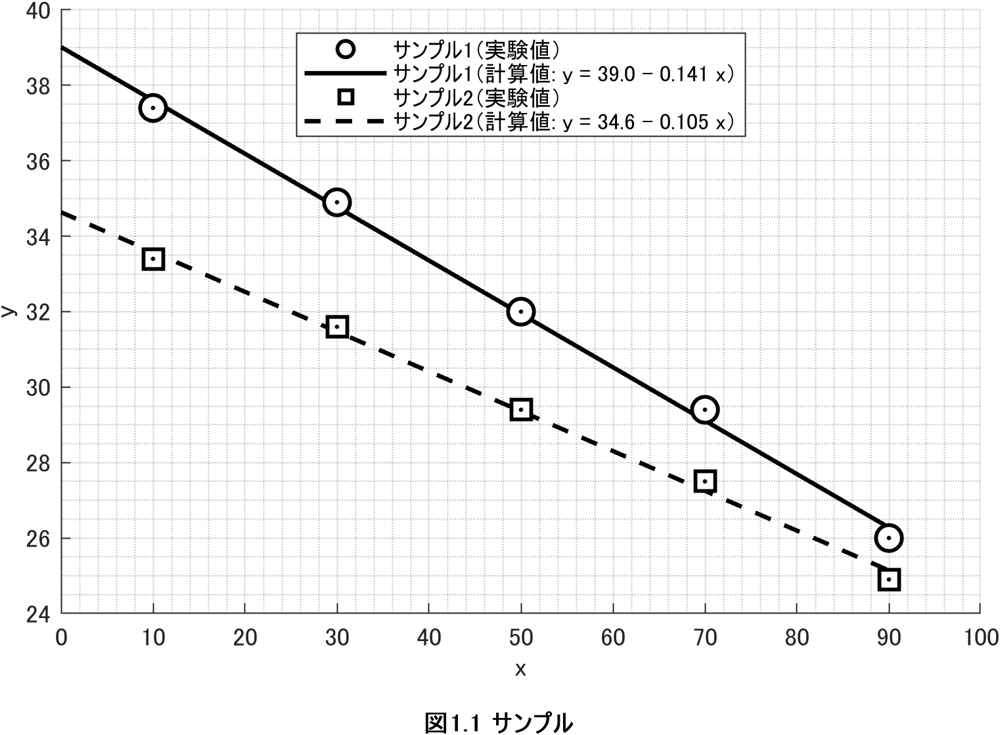

# GraphPlotter

複数のデータセットに対して **最小二乗法** による回帰直線・多項式フィットを行い、同一グラフ上に描画する MATLAB スクリプト 
<br>
※ グラフの書式は某大学の実験レポートのレイアウト指定に準じている


<br>*出力されるグラフ(サンプル)*
.png)
*実行時のMATLAB画面*
<br>
- GraphProtter.mと同じフォルダ内に実験データを入力したCSVファイルと出力データを格納するresultsフォルダを作成
- この際,CSVにヘッダー名はつけず数値のみ入力すること
- MATLAB上でGraphProtter.mを実行する
- コマンドウィンドウ上の指示に従って入力していく
- qボタンを押せばプログラムが終了する. Ctrl+Cで強制終了
- resultsフォルダ内にグラフのpngファイルと,各種計算データが格納されたtxtファイルが出力される

---

## 本プログラムで使用した理論

### 問題設定

与えられたデータ点 $(x_i, y_i)$ を直線

$$
y = a + b x
$$

で近似する。

### 誤差の定義

各点の残差を

$$
e_i = y_i - (a + b x_i)
$$

とし、残差平方和

$$
S(a,b) = \sum_{i=1}^{N} e_i^2
$$

を最小化する。

### 正規方程式

偏微分して整理すると、以下の連立方程式を得る：

$$
\begin{cases}
N a + b \sum x_i = \sum y_i \\
a \sum x_i + b \sum x_i^2 = \sum x_i y_i
\end{cases}
$$

行列形式で表すと：

$$
X = \begin{bmatrix}
1 & x_1 \\
1 & x_2 \\
\vdots & \vdots \\
1 & x_N
\end{bmatrix},
\quad
\beta = \begin{bmatrix} a \\ b \end{bmatrix},
\quad
y = \begin{bmatrix} y_1 \\ y_2 \\ \vdots \\ y_N \end{bmatrix}
$$

$$
X^\mathsf{T} X \beta = X^\mathsf{T} y
$$

### 解

$$
\hat{\beta} = (X^\mathsf{T} X)^{-1} X^\mathsf{T} y
$$

MATLABでは

```matlab
coef = X \ y;
```

と書くだけで、この最小二乗解を計算できる。

### 精度指標

* **決定係数 $R^2$**

  $$
  R^2 = 1 - \frac{\text{SSE}}{\text{SST}}
  $$

  * SSE = 残差平方和
  * SST = 全体平方和
    $R^2=1$ に近いほどモデルの説明力が高い。

* **RMSE（二乗平均平方根誤差）**

  $$
  \text{RMSE} = \sqrt{\frac{1}{N}\sum (y_i - \hat{y}_i)^2}
  $$

  誤差の平均的な大きさを表す。

---
